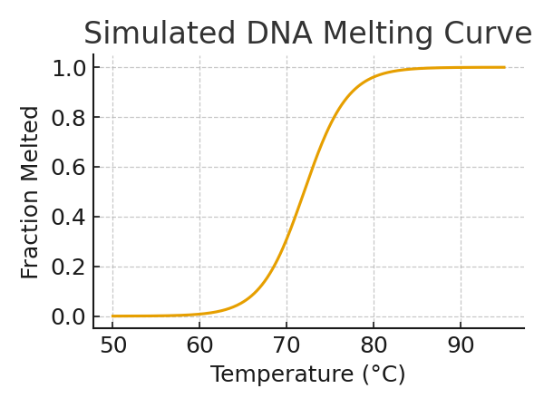

# **Exercise 1 — Introduction to DNA Melting Curves**

## **Overview**

DNA melting curves describe how double-stranded DNA (dsDNA) separates into single strands as temperature increases. In this exercise, students learn both the biochemistry behind DNA melting and how melting behavior is simulated using thermodynamic models.

---

## **Purpose**

This exercise helps students:
Understand the biochemical basis of DNA melting and how melting curves are measured experimentally.
Understand how melting curves are simulated using the nearest-neighbor thermodynamic model.
Identify key melting-curve features (baseline, transition region, Tm).
Compare melting behaviors of short vs long DNA and AT-rich vs GC-rich sequences.
Interpret melting curves and derivative curves to distinguish among different DNA amplicons.

---

## **Exercise Scenario**

You are assisting a new member in a virology lab who is learning to interpret melting curves from both real experiments and the simulator. Your task is to analyze several reference melting curves and explain their features.

---

# **Background Concepts**

**1. What a DNA Melting Curve Represents**
   
A DNA melting curve shows how a population of dsDNA gradually becomes single-stranded as temperature increases.
The simulator reports Fraction Melted:
0.0 → fully double-stranded
1.0 → fully single-stranded
Plotting Fraction Melted vs Temperature produces the melting curve.

---

**2. Biochemistry vs Simulation**

**Biochemistry of Melting**
DNA melts gradually as hydrogen bonds and base-stacking interactions weaken.
Heating destabilizes local regions, which then promotes melting in neighboring segments (cooperative melting).
Experimental melting curves are measured using fluorescence dyes or absorbance changes.

**Simulation of Melting**
The simulator uses the nearest-neighbor thermodynamic model (SantaLucia model).
Each adjacent base pair contributes enthalpy and entropy values.
The model assumes perfectly complementary strands.
Mismatches are NOT modeled in this version of the software.
Salt concentration, sequence context, and length influence stability.

**3. How a Melting Curve Is Organized**

DNA melting typically shows three regions:

1. Low-Temperature Baseline   
DNA fully duplexed
Fraction Melted ≈ 0
Curve is flat

2. Cooperative Transition Region
Local domains begin to melt.
Cooperativity causes a steep rise in the curve.

3. High-Temperature Plateau
DNA fully melted
Fraction Melted ≈ 1
Curve becomes flat again
---

**4. Melting Temperature (Tm)**
The Tm is the temperature at which 50% of molecules are melted.
Higher Tm → more stable DNA (GC-rich)
Lower Tm → less stable DNA (AT-rich)
---
**5. AT-Rich vs GC-Rich DNA**

GC pairs:
3 hydrogen bonds
Stronger stacking interactions
AT pairs:
2 hydrogen bonds
Therefore:
GC-rich sequences → higher Tm
AT-rich sequences → lower Tm
Students will compare GC/AT-rich curves in Task 4.

---

**6. Short (<100 bp) vs Long (>200 bp) DNA Melting Behavior**

Short DNA
Usually melts in a single cooperative step.
Melting curve is a simple sigmoidal curve.
Derivative curve (–dF/dT) shows one sharp peak.
Include a simple curve plot here.
Longer DNA
Contains regions with different GC content.
AT-rich domains melt earlier; GC-rich domains melt later.
Produces multiple melting transitions (multi-phase curves).
Include a multi-phase curve plot here.
The first derivative curve will show two or more peaks, each indicating a melt domain.

---
**7. First-Derivative Melting Curves (–dF/dT)**

Derivative curves show how rapidly DNA is melting at each temperature.
Short DNA → one peak
Long DNA → multiple peaks (multiple melting domains)
Derivative curves make it easier to:
Identify Tm
Visualize domain structure
Distinguish subtly different sequences

---

## **Example Melting Curve (Simulated)**

This plot illustrates the typical S-shaped melting profile generated by a thermodynamic model.

---
**8. Factors That Influence Melting Behavior**

Besides sequence composition:
**Salt concentration**
Higher Na⁺ or Mg²⁺ stabilizes dsDNA → Tm increases
**Buffer additives**
DMSO, formamide destabilize dsDNA → Tm decreases
**Sequence complexity**
Repeats or homopolymer regions melt more uniformly
(correction from Bob)
**Mismatches**
Biochemically, mismatches lower duplex stability.
Our simulator does NOT model mismatches, and assumes each DNA molecule is perfectly complementary.
(as Bob instructed)

**Why Longer Sequences Have Multiple Melting Domains**
GC-rich regions are more stable
AT-rich regions open first
The molecule does not melt in a single step
This creates two or more melting transitions
Students will visualize this using derivative curves

---

**Common Misconception Box**
**Misconception: **“A DNA sequence has one Tm.”

**Reality:**
Short DNA usually has one melting transition.
Longer DNA may have multiple melting domains and therefore multiple melting peaks.

---

**High Resolution Melting (HRM) — Brief Introduction**

High-Resolution Melting (HRM) is a sensitive method that detects small sequence differences by analyzing precise melting curves.

HRM is commonly used for:
SNP/variant detection
Mutation scanning
Allele discrimination

Small sequence differences cause subtle shifts in melting shape or Tm, which HRM can detect with high accuracy.

---

**Tasks**

**1. Visualize Melting Curves**
Plot the melting curve for:
Sequence A (short, <100 bp)
Sequence B (longer, >200 bp)
Label:
Low-temperature baseline
Cooperative transition region(s)
Tm or Tm peaks

---

**2. Determine the Tm**
For each curve:
Identify temperature where Fraction Melted = 0.5 (if single-domain)
Identify the main derivative peak (if multi-domain)
Record these values.

---

**3. Compare Short vs Long Melting Behavior**
Answer:
Why does the short DNA melt in one smooth step?
Why does the long DNA have multiple melting transitions?
How do derivative peaks help identify melting domains?

---

**4. Compare AT-rich vs GC-rich Amplicons**
You will be given:
Curve A: AT-rich
Curve B: GC-rich
Answer:
Which curve has lower Tm?
Which sequence is more stable?
What sequence feature explains this difference?

---

**5. Rule-of-Thumb Tm Estimates**
Using the short DNA sequence (<100 bp):
Calculate Tm using the simple formula:
**Tm ≈ 2°C × (A+T) + 4°C × (G+C)**
Use an online Tm calculator.
Compare both with the simulator’s Tm.
Write a short explanation of similarities/differences.

---

**6. Application Question**
Provide one real-world example of melting curve applications:
Checking PCR product specificity
Detecting SNPs
Genotyping alleles
Assessing DNA stability

---

# **Glossary**

### **Tm**  
Temperature at which 50% of DNA molecules are melted.

### **Fraction Melted**  
Proportion of molecules that are single-stranded at a given temperature.

### **dsDNA**  
Double-stranded DNA (native form).

### **ssDNA**  
Single-stranded DNA (denatured form).

### **Cooperative Melting**  
Process where melting in one region destabilizes neighboring regions.

### **Baseline**  
Low-temperature region where DNA is fully double-stranded.

### **Plateau**  
High-temperature region where DNA is fully melted.

---

